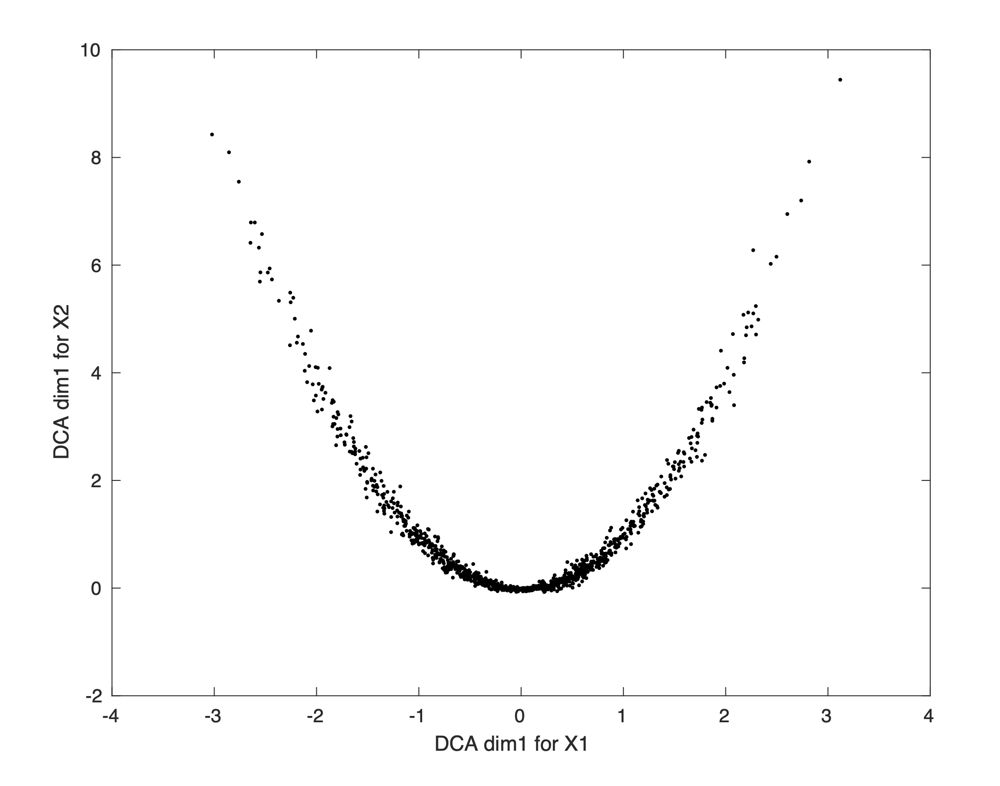

# dca
Distance Covariance Analysis

This readme will be updated soon with a user-friendly way to run DCA!

Reference:  
"Distance covariance analysis." BR Cowley, JD Semedo, A Zandvakili, A Kohn, MA Smith, BM Yu (*AISTATS*, pp. 242-251, 2017).

# Example code (Matlab)

```matlab
% DCA will identify a nonlinear interaction between X1 and X2
Xs{1} = randn(20,1000);
Xs{2} = Xs{1}(1:5,:).^2;
Ds{1} = squareform(pdist(Xs{1}(1,:)' + Xs{2}(1,:)'));
[U, dcovs] = dca(Xs, Ds, 'num_dca_dimensions', 5);
% plot first DCA dimension in Xs{1} vs Xs{2}
x1 = U{1}(:,1)' * Xs{1}
x2 = U{2}(:,1)' * Xs{2}
plot(x1, x2, '.k'); xlabel('DCA dim 1 for X1'); ylabel('DCA dim 1 for X2')
```


